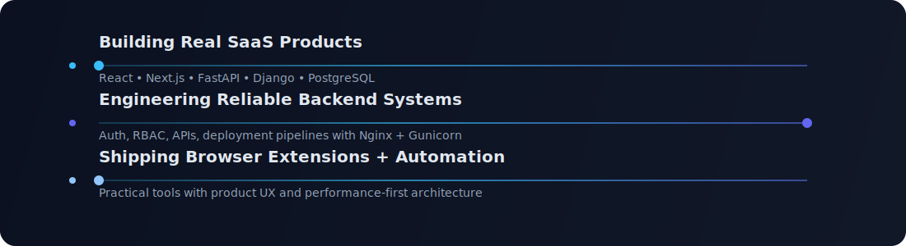
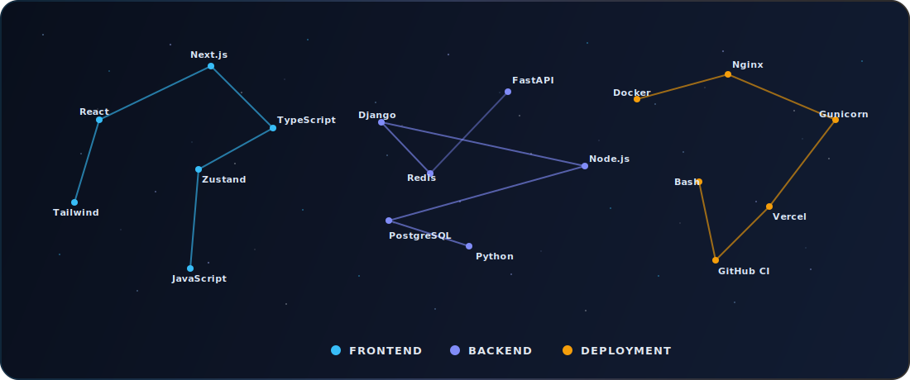
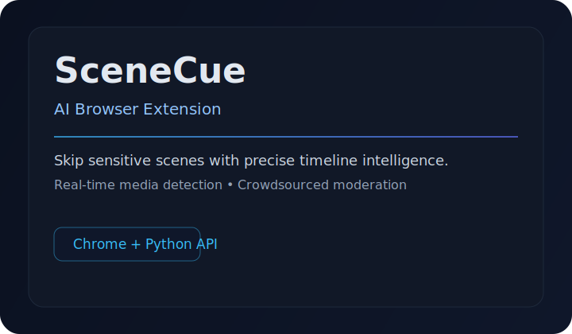
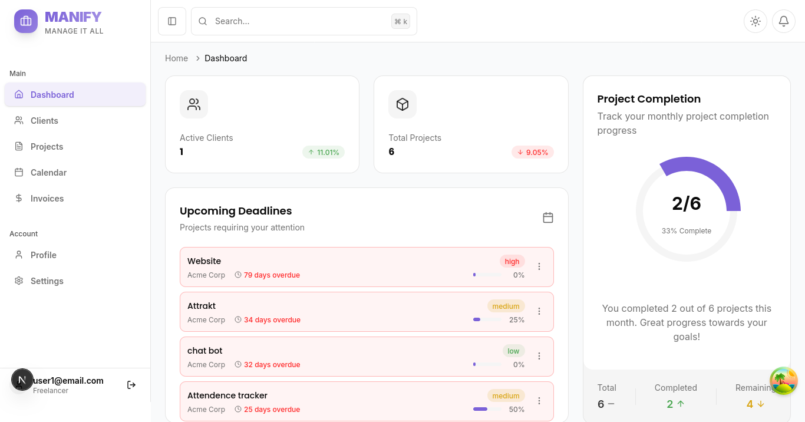
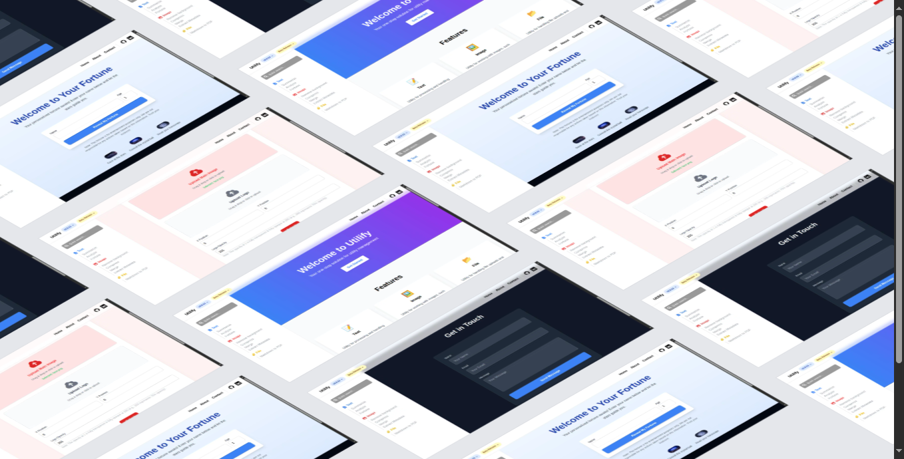
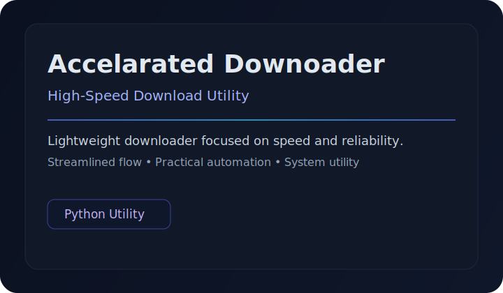

  

  

  

    
    &nbsp;&nbsp;
    
  

  

  

  

## Tech Stack

  

  
<strong>Stack Breakdown</strong>

  

    Frontend: React, Next.js, TypeScript, Zustand • Backend: Django, FastAPI, Node.js, Python, PostgreSQL • Deployment: Docker, Nginx, Gunicorn, Vercel, GitHub CI
  

  

## Featured Projects

|  |  |
| :---: | :---: |
| **[SceneCue](https://github.com/SSKnT/scenecue)** | **[Manify](https://github.com/SSKnT/manify)** [🌐](https://manify.synplex.studio) |
| AI extension that skips sensitive scenes with timestamp intelligence. | SaaS for freelancers to manage clients, projects, and budgets. |
|  |  |
| **[Utilify](https://github.com/SSKnT/utilify-webapp)** [🌐](https://utilify-seven.vercel.app) | **[Accelarated Downoader](https://github.com/SSKnT/Accelarated-Downoader)** |
| Utility platform for text, file, and workflow automation. | High-speed download utility built for practical automation workflows. |

See more projects

| Name | What it does | Stack |
| --- | --- | --- |
| **[dev-portfolio](https://github.com/SSKnT/dev-portfolio)** | Minimalist portfolio customized with your projects and personal brand. | Gatsby, JavaScript |
| **[freelance-web-workflow](https://github.com/SSKnT/freelance-web-workflow)** | End-to-end workflow for building and managing freelance websites. | Web Workflow |
| **[my-fitnesspal](https://github.com/SSKnT/my-fitnesspal)** | Fitness app with calorie tracking, logging, and progress insights. | React, Django |
| **[recurrence-solver](https://github.com/SSKnT/recurrence-solver)** | Solver for recurrence relations with algorithm-analysis use cases. | Python, Streamlit |
| **[cryptkeep](https://github.com/SSKnT/cryptkeep)** | Interactive CTF web app with puzzle-based security challenges. | Next.js, Tailwind |
| **[Workplace-Management](https://github.com/SSKnT/Workplace-Management)** | Workplace management application for operational workflows. | C# |
| **[React-weather](https://github.com/SSKnT/React-weather)** | Weather UI app built in React with clean client-side flows. | React, JavaScript |
| **[PixelPulse-Store](https://github.com/SSKnT/PixelPulse-Store)** | Ecommerce-style Django web app focused on core store features. | Django |
| **[Blog](https://github.com/SSKnT/Blog)** | Blog platform project built during early backend learning phase. | Python |
| **[Text-Based-Game](https://github.com/SSKnT/Text-Based-Game)** | Command-line style game showcasing fundamentals and logic flow. | Python |

  

## Engineering Pulse

  

  

## Activity

  

  

## 3D Contributions

  

  

