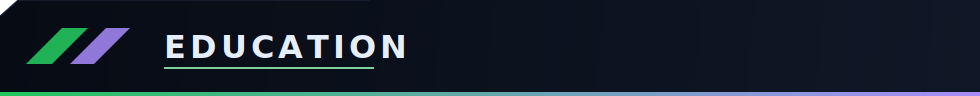
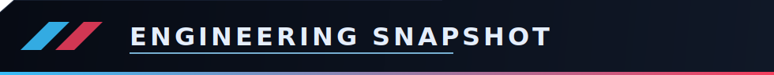

 

Software engineer building full-stack SaaS platforms, browser extensions, and backend systems with clean architecture and production-first deployment standards.

- Location: Lahore, Pakistan
- Founder: Synplex (Freelance Engineering)
- Core strength: taking products from idea to deployed system

  
  
  
  
  
  
  
  
  
  
  
  
  

### Manify - Full-Stack SaaS Platform

- Built a SaaS platform for freelancers to manage clients, projects, and budgets.
- Designed Django REST APIs with authentication, RBAC, and secure access controls.
- Deployed full production stack on VPS with Nginx and Gunicorn.
- Implemented JWT and Google OAuth for scalable authentication.

### SceneCue - Content-Aware Browser Extension

- Built an extension that detects active media and flags sensitive scenes using timestamp intelligence.
- Integrated TMDB APIs for real-time search and title identification.
- Developed backend moderation flows for crowdsourced timestamp submissions.

### MyFitnessPal - Fitness and Community Platform

- Built workout logging and social engagement features in a single product.
- Implemented structured backend models and authentication workflows.
- Designed for consistency, interaction, and long-term user retention.

### Utilify - Utility Platform

- Built a multi-tool utility platform to handle repetitive text, image, and file workflows.
- Combined Django APIs with a React interface for fast, task-oriented user flows.
- Deployed and maintained the project in a production environment.

University of Engineering and Technology, Lahore  
BS Computer Science | Sep 2023 - Apr 2027

  

  

